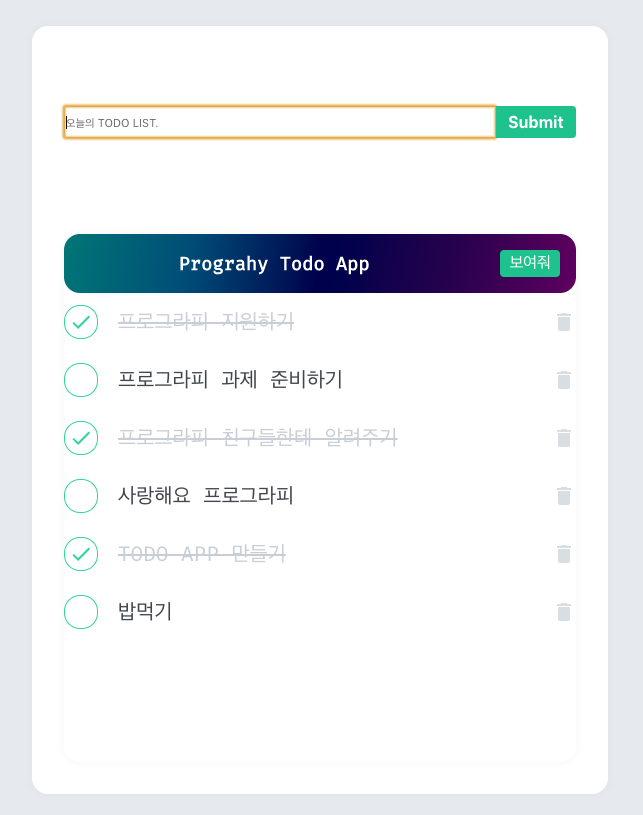

# 프로그라피 React 

## 요구사항
[X] 입력한 todo
[X] todos list에 추가
[X] 'x' 버튼 클릭 시 list에서 삭제
[X] list에서 클릭 시, 취소선 표시 + 완료된 상태
[X] todos list 접기/펼치기
[X] Hooks API 사용
[X] 부트스트랩 사용 x
[X] position: absolute 사용 x

